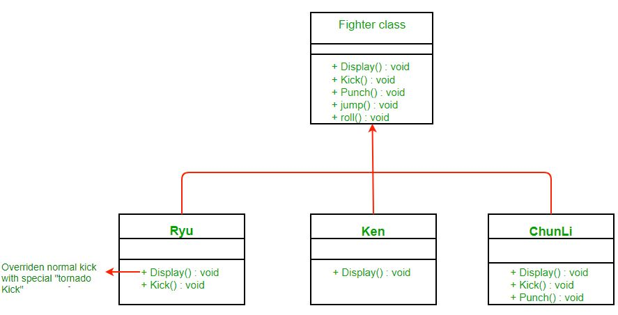
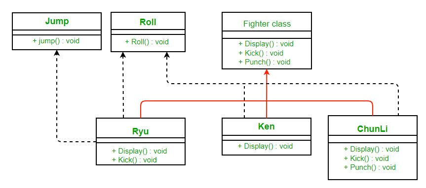

# Strategy Pattern

## Overview

Strategy pattern là một mẫu thiết kế hành vi(behavioral design pattern) cho phép chọn hành vi của một đối tượng trong thời gian chạy.

Ý tưởng của Strategy pattern là đóng gói nhóm các thuật toán của một lớp riêng biệt thành một giao diện chung.

Strategy pattern bao gồm ba thành phần chính: context, strategy và concrete strategy
- Context là lớp chứa đối tượng có hành vi cần được thay đổi linh hoạt.
- Strategy là giao diện hoặc lớp trừu tượng xác định các phương thức chung cho tất cả các thuật toán mà đối tượng Context có thể sử dụng.
- Chiến lược cụ thể là lớp triển khai giao diện Strategy và cung cấp cách triển khai thực tế của thuật toán.

Để triển khai Strategy pattern trước tiên tạo một đối tượng Context. Sau đó, tạo một hoặc nhiều đối tượng Concrete Strategy mà triển khai giao diện Strategy. Cuối cùng, bạn thiết lập đối tượng Strategy cho đối tượng Context bằng cách gọi phương thức của nó.

##  Strategy pattern cung cấp một số advantages:
1. **Flexibility**: thay đổi hành vi của một đối tượng một cách linh hoạt trong thời gian chạy bằng cách chọn những thuật toán khác nhau.
2. **Modularity**: đóng gói các thuật toán trong các lớp riêng biệt, giúp dễ dàng thêm hoặc xóa thuật toán mà không ảnh hưởng đến các phần khác của mã.
3. **Testability**: giúp dễ dàng kiểm tra các thuật toán khác nhau một cách riêng biệt mà không ảnh hưởng đến hoạt động chung của mã.
4. **Open-Closed Principle**: một lớp phải mở để mở rộng nhưng đóng để sửa đổi.

> Tuy nhiên, Strategy pattern cũng có thể có một số nhược điểm bao gồm độ phức tạp tăng lên do sử dụng nhiều lớp và các vấn đề tiềm ẩn về hiệu suất nếu việc lựa chọn thuật toán được thực hiện thường xuyên trong thời gian chạy.

## Example
Giả sử, chúng ta đang xây dựng trò chơi "Street Fighter". Để đơn giản, giả sử rằng một nhân vật có thể có 4 động tác là kick(đá), punch(đấm), roll(lăn), jump(nhảy). Mỗi nhân vật đều có các động tác kick và punch, nhưng roll và jump là optional. How would you model your classes? Giả sử ban đầu bạn sử dụng tính kế thừa và trừu tượng hóa các đặc điểm chung trong một lớp Fighter.

Lớp Fighter sẽ thực hiện mặc định các hành động bình thường. Bất kỳ nhân vật nào có chiêu thức chuyên biệt đều có thể ghi đè hành động đó trong lớp con của nó. Sơ đồ lớp sẽ như sau:

**Các vấn đề với thiết kế trên là gì?** Điều gì sẽ xảy ra nếu nhân vật không thực hiện động tác nhảy? Nó vẫn kế thừa hành vi nhảy từ siêu lớp. Mặc dù bạn có thể ghi đè lệnh nhảy để không làm gì trong trường hợp đó nhưng bạn có thể phải làm như vậy đối với nhiều lớp hiện có và xử lý việc đó cho các lớp trong tương lai. Điều này cũng sẽ gây khó khăn cho việc bảo trì. Vì vậy chúng ta không thể sử dụng tính kế thừa ở đây.

Nó sạch hơn nhiều. Loại bỏ một số hành động (mà một số nhân vật có thể không thực hiện) khỏi Fighter class và tạo giao diện cho chúng. Bằng cách đó, chỉ những nhân vật được cho là phải nhảy mới triển khai Jump.

**What are the problems with the above design?**
Vấn đề chính với thiết kế trên là việc sử dụng lại mã (code reuse). Vì không có triển khai mặc định cho hành vi jump và roll nên có thể có duplicate code. Có thể viết đi viết lại code cho cùng hành vi trong nhiều lớp con.

**How can we avoid this?**
Điều gì sẽ xảy ra nếu chúng ta tạo ra các lớp JumpBehavior và RollBehavior thay vì giao diện? Vậy thì chúng ta sẽ phải sử dụng tính năng đa kế thừa vốn không được hỗ trợ ở nhiều ngôn ngữ do có nhiều vấn đề liên quan đến nó.

> [!TIP]
> Ở đây strategy pattern đã giúp ích cho chúng ta. Chúng ta sẽ tìm hiểu mô hình strategy là gì và sau đó áp dụng nó để giải quyết vấn đề của mình.

## Definition Strategy Pattern
Trong computer programming, strategy pattern (hay còn được gọi là policy pattern) là một mẫu thiết kế phần mềm cho phép chọn hành vi của thuật toán trong thời gian chạy.
- Định nghĩa một nhóm thuật toán
- Đóng gói từng thuật toán 
- Làm cho thuật toán có thể hoán đổi cho nhau trong nhóm

## Class Diagram strategy pattern

Ở đây chúng tôi dựa vào thành phần thay vì kế thừa để tái sử dụng (reuse). Context bao gồm một Strategy. Thay vì thực hiện một hành vi, Context ủy quyền cho Strategy. Context sẽ là lớp yêu cầu thay đổi hành vi. Chúng ta có thể thay đổi hành vi một cách linh hoạt. Strategy được triển khai như một giao diện để chúng ta có thể thay đổi hành vi mà không ảnh hưởng đến context của mình.

## Advantages:
1. Một nhóm thuật toán có thể được định nghĩa như một hệ thống phân cấp lớp và có thể được sử dụng thay thế cho nhau để thay đổi hành vi ứng dụng mà không thay đổi kiến ​​trúc của nó.
2. Bằng cách đóng gói thuật toán riêng biệt, các thuật toán mới có cùng giao diện có thể được đưa ra một cách dễ dàng.
3. Ứng dụng có thể chuyển đổi strategy trong thời gian chạy.
4. Strategy cho phép khách hàng chọn thuật toán được yêu cầu mà không cần sử dụng câu lệnh “switch” hoặc một loạt câu lệnh “if-else”.
5. Các cấu trúc dữ liệu được sử dụng để triển khai thuật toán được gói gọn hoàn toàn trong các lớp strategy. Do đó, việc triển khai thuật toán có thể được thay đổi mà không ảnh hưởng đến lớp context.

## Disadvantages:
1. Ứng dụng phải nhận thức được tất cả các strategy để chọn strategy phù hợp cho tình huống phù hợp.
2. Các lớp strategy và bối cảnh thường giao tiếp thông qua giao diện được chỉ định bởi lớp cơ sở strategy trừu tượng. Lớp cơ sở strategy phải hiển thị giao diện cho tất cả các hành vi được yêu cầu, điều mà một số lớp strategy cụ thể có thể không triển khai.
3. Trong hầu hết các trường hợp, ứng dụng sẽ định cấu hình context với đối tượng strategy được yêu cầu. Do đó, ứng dụng cần tạo và duy trì hai đối tượng thay cho một đối tượng.

## Implementation
Bước đầu tiên là xác định các hành vi có thể khác nhau giữa các lớp khác nhau trong tương lai và tách chúng ra khỏi các lớp còn lại. Trong ví dụ của chúng tôi, hãy để chúng có hành vi jump và kick. Để tách biệt những hành vi này, chúng ta sẽ kéo cả hai phương thức ra khỏi lớp Fighter và tạo một tập hợp các lớp mới để thể hiện từng hành vi.